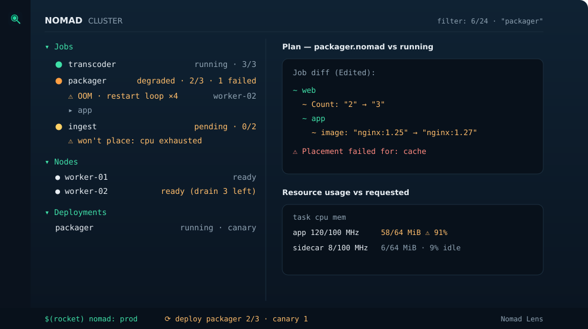

# Nomad Lens

[](https://marketplace.visualstudio.com/items?itemName=allannava95.nomad-lens)
[](https://marketplace.visualstudio.com/items?itemName=allannava95.nomad-lens)
[](https://github.com/Allan-Nava/nomad-lens/actions/workflows/ci.yml)
[](LICENSE)

**HashiCorp Nomad operations inside VS Code** — the place where you already edit your job specs.

🌐 **[Website →](https://allan-nava.github.io/nomad-lens/)** · 📖 **[Full documentation →](https://allan-nava.github.io/nomad-lens/guide.html)** (source: [docs/GUIDE.md](docs/GUIDE.md))



<sub>Illustration of the Nomad view: job health with OOM/restart-loop flags, "won't place" diagnostics, plan diff repo↔running, and live resource usage.</sub>

## Features

- **Cluster explorer** — jobs with real health (a `running` job missing allocations shows as **degraded**), allocations with restart counts, tasks, nodes (ready/drain), active deployments. Multi-cluster via settings, one click to switch.
- **Cluster dashboard** — a webview panel with a job-health donut, the problem list, nodes needing attention, and active deployments with progress bars. Zero-dependency SVG charts, theme-aware, one Refresh away.
- **Detail panels & log console** — per-job and per-node webviews (allocations, resource gauges + sparklines, version history, drain/eligibility) with action buttons that reuse the confirmed commands, plus a log console with level colouring, a live filter and follow/wrap. Dashboard and job panels update in place on each poll tick.
- **Global search** — one QuickPick over every job of every configured cluster; pick one to switch cluster and open its panel.
- **Plan diff, repo vs running** — open a `.nomad`/`.hcl` job spec and run *Plan Current Job File*: the spec is parsed server-side and planned against the running job, and the diff opens beside your editor. If the diff contains more than you expected, you know **before** deploying.
- **Job version history & revert** — every registered version of a job with the diff of what each one changed, and a revert that first plans the old spec against what is running, so you see the rollback before you confirm it (confirmation by typing the job id).
- **Live task logs** — follow stdout/stderr of any task in an Output channel (streaming, not polling); multiple streams side by side.
- **Incident bundle in one click** — for a failed allocation: `incidents/<date>-<job>-<alloc>/` with a ready-to-fill `report.md` (task event timeline, node, restart counts) plus the tail of stdout/stderr as attached log files. Your incident report is half-written before you start.
- **Cluster snapshot** — one command generates a markdown health report: problems first (degraded jobs, drained nodes, stuck deployments), full job table after. Perfect for the morning check or as a preflight baseline.

## Go `vulncheck` auto-fix

If you also use the Go extension, its `go.diagnostic.vulncheck` setting ships a default of `"Prompt"` that the `gopls` language server rejects (`Invalid settings: … invalid option "Prompt"`). On activation Nomad Lens detects this and sets a valid value (`"Off"` by default), with a dismissable notification and an undo action. Opt out with `nomadLens.autoFixGoVulncheck: false`, or prefer active scanning with `nomadLens.goVulncheckFixValue: "Imports"`.

## Security

ACL tokens are read from an environment variable (you configure the variable *name* per cluster via `tokenEnv`) — tokens are never stored in settings and never displayed.

## Settings

```jsonc
"nomadLens.clusters": [
  { "name": "dev",     "address": "http://nomad-dev.example:4646" },
  { "name": "prod",    "address": "https://nomad.example:4646", "namespace": "default", "tokenEnv": "NOMAD_TOKEN_PROD" }
]
```

## Development

```bash
npm install
npm test             # unit tests + integration against a throwaway `nomad agent -dev`
npm run build        # bundle to dist/
npm run site         # generate site/guide.html from docs/GUIDE.md
# F5 in VS Code launches the Extension Development Host
```

### With Docker

```bash
docker compose run --rm tests      # full suite (unit + integration) in a container, pinned Nomad
docker compose --profile demo up   # dev Nomad on http://127.0.0.1:4646 + sample job
```

`tests` runs the whole suite reproducibly (the same checks as CI, with an internal throwaway `nomad agent -dev`). The `demo` profile starts a persistent Nomad with a sample job (two allocations that log, including `error` lines to try the grep out): point the extension at it via `nomadLens.clusters` → `http://127.0.0.1:4646`. Requires Docker Desktop (the services run `privileged` with a writable cgroup, because the Nomad client creates its own cgroups).

The core (API client + report renderers) has no VS Code dependency and lives in `src/core/`. The integration test spins up `nomad agent -dev` on a random port, registers a sample job, and verifies plan diffs; if `nomad` is not installed the integration tests are skipped. Zero runtime dependencies: the Nomad HTTP API is consumed with Node's native fetch.

## Release & automation

Everything is driven by CI (`.github/workflows/`):

- **Publish on tag** — pushing a `v*` tag runs the full test suite, packages the `.vsix` onto the GitHub Release, then publishes to the **VS Code Marketplace** (`vsce publish`) and, if configured, **Open VSX** (`ovsx publish`). A guard aborts if the tag doesn't match `version` in `package.json`.
  - Required secret: `VSCE_PAT` — an Azure DevOps Personal Access Token for the Marketplace publisher named in `package.json` (`publisher`). See the [vsce publishing docs](https://code.visualstudio.com/api/working-with-extensions/publishing-extension).
  - Optional secret: `OVSX_PAT` — an [Open VSX](https://open-vsx.org) token. Omit it and that step is skipped.
  - The `publish` job uses the `marketplace` [environment](https://docs.github.com/actions/deployment/targeting-different-environments/using-environments-for-deployment) — add required reviewers there if you want a manual approval gate before each store publish.
- **Backlog sync** — editing `BACKLOG.md` on `main` mirrors it to GitHub **milestones + issues** (`scripts/backlog-sync.mjs`, zero deps, native fetch). Each `## …` heading becomes a milestone, each `NOM-n` item an issue (anchored by a hidden `<!-- backlog:NOM-n -->` marker so retitling never duplicates). Checked items close their issue; a fully-checked section closes its milestone. `BACKLOG.md` stays the single source of truth — GitHub is a read-only mirror. Run it manually (with a dry-run toggle) from the Actions tab.

To cut a release: bump `version` in `package.json`, add a `CHANGELOG.md` entry, commit, then `git tag -a vX.Y.Z -m "Release X.Y.Z" && git push --follow-tags`.

## License

MIT
